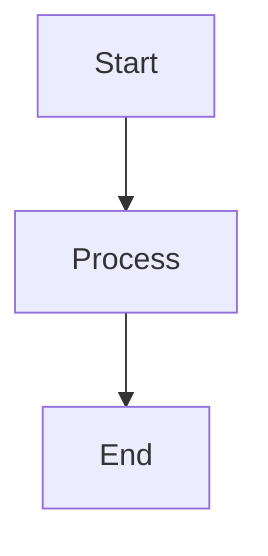

# Struktur Wiki - Bengkel Koding Web V2

## Organisasi Dokumentasi

Wiki ini diorganisir dalam beberapa kategori untuk memudahkan navigasi dan pencarian informasi:

### **Getting Started** (Memulai)

Dokumentasi untuk developer baru yang ingin memahami proyek secara cepat.

- `getting-started-Software-Vision.md` - Ringkasan visi dan tujuan software
- `getting-started-Technical-Architectures.md` - Overview arsitektur teknis

### **Development Guide** (Panduan Pengembangan)

Panduan teknis untuk developer yang akan berkontribusi dalam development.

- `development-guide-Installation.md` - Panduan instalasi project (Bahasa Indonesia)
- `development-guide-Database-Schema.md` - Penjelasan struktur database
- `development-guide-Django-HTMX-Coding-Standards.md` - Coding standards dan conventions
- `development-guide-UI-UX-Standards.md` - Standar design system
- `development-guide-Error-Handling.md` - Debugging dan error handling (Bahasa Indonesia)
- `development-guide-Deployment.md` - Deployment dengan CI/CD dan PM2 (Bahasa Indonesia)

### **Project Planning** (Perencanaan Proyek)

Dokumentasi perencanaan dan requirement gathering.

- `project-planning-User-Story-Map.md` - User stories dari berbagai perspektif
- `Requirement-Specification.md` - Functional dan non-functional requirements

### **Technical Documents** (Dokumen Teknis Lengkap)

Dokumentasi teknis detail untuk referensi mendalam.

- `software-vision.md` - Dokumen visi software lengkap
- `technical-architectures.md` - Arsitektur sistem detail
- `database-schema.md` - ERD dan skema database lengkap
- `srs.md` - Software Requirement Specification komprehensif

---

## Cara Menggunakan Wiki

### Untuk Developer Baru:

1. Mulai dengan [Home](Home.md) untuk overview proyek
2. Baca [Software Vision](getting-started-Software-Vision.md) untuk memahami tujuan
3. Pelajari [Technical Architectures](getting-started-Technical-Architectures.md)
4. Setup environment mengikuti [Installation Guide](development-guide-Installation.md)
5. Pelajari [Coding Standards](development-guide-Coding-Standards.md)

### Untuk Developer yang Sudah Familiar:

1. Gunakan sidebar untuk navigasi cepat ke bagian yang dibutuhkan
2. Ikuti [Coding Standards](development-guide-Coding-Standards.md) untuk konsistensi kode
3. Gunakan [Error Handling Guide](development-guide-Error-Handling.md) untuk debugging
4. Referensi [Deployment Guide](development-guide-Deployment.md) untuk deploy process

### Untuk Product Manager / Stakeholder:

1. Review [User Story Map](project-planning-User-Story-Map.md) untuk melihat feature flow
2. Cek [Requirement Specification](Requirement-Specification.md) untuk tracking requirements
3. Lihat [SRS](srs.md) untuk dokumentasi lengkap

---

## Konvensi Penulisan

### Format Markdown

- Gunakan heading hierarchy: `#` untuk judul utama, `##` untuk sub-bagian
- Gunakan **bold** untuk emphasis penting
- Gunakan `code` untuk inline code atau nama file
- Gunakan code blocks dengan syntax highlighting untuk contoh kode

### Internal Links

Gunakan relative links untuk navigasi antar dokumen:

```markdown
[Lihat Arsitektur](technical-architectures)
```

### Diagram

Gunakan Mermaid untuk diagram visual:



---

## Update dan Maintenance

### Version Control

- Setiap perubahan signifikan harus didokumentasikan dengan tanggal update
- Gunakan semantic versioning untuk tracking versi dokumentasi
- Commit message harus jelas mendeskripsikan perubahan

### Review Process

1. Draft perubahan dokumentasi
2. Review oleh lead developer atau tech lead
3. Merge ke production branch setelah approved

---

## Struktur Folder Wiki

```
wiki/
├── Home.md                                          # Halaman utama
├── Wiki-Structure.md                                # Dokumen ini
├── _Sidebar.md                                      # Navigasi sidebar
├── _Footer.md                                       # Footer info
│
├── getting-started-Software-Vision.md               # Quick start: Vision
├── getting-started-Technical-Architectures.md       # Quick start: Architecture
│
├── development-guide-Database-Schema.md             # Dev guide: Database
├── development-guide-Django-HTMX-Coding-Standards.md # Dev guide: Coding
├── development-guide-UI-UX-Standards.md             # Dev guide: UI/UX
│
├── project-planning-User-Story-Map.md               # Planning: User stories
├── Requirement-Specification.md                     # Planning: Requirements
│
├── software-vision.md                               # Full doc: Vision
├── technical-architectures.md                       # Full doc: Architecture
├── database-schema.md                               # Full doc: Database
└── srs.md                                          # Full doc: SRS
```

---

## Best Practices

### Menulis Dokumentasi yang Baik

1. **Be Clear**: Gunakan bahasa yang jelas dan mudah dipahami
2. **Be Concise**: Hindari penjelasan yang terlalu panjang
3. **Use Examples**: Sertakan contoh code atau screenshot
4. **Keep Updated**: Perbarui dokumentasi seiring perubahan kode
5. **Link Properly**: Buat link ke dokumen terkait untuk context

### Mencari Informasi

1. Gunakan search function (Ctrl+F) dalam dokumen
2. Check sidebar untuk navigasi cepat
3. Lihat table of contents di awal setiap dokumen
4. Gunakan internal links untuk jumping antar sections

---

**Tip**: Bookmark halaman wiki yang sering diakses untuk efisiensi!

---

_Last updated: November 2025_
