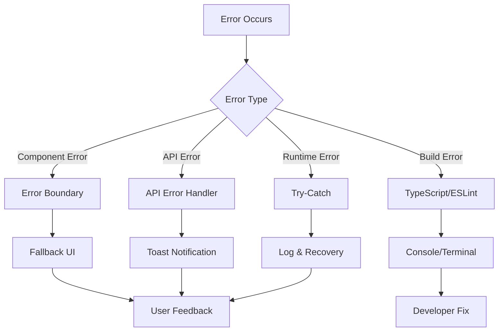

# Panduan Error Handling & Debugging - Bengkel Koding Web V2

## Daftar Isi

1. [Error Handling Strategy](#1-error-handling-strategy)
2. [Common Errors & Solutions](#2-common-errors--solutions)
3. [Debugging Tools](#3-debugging-tools)
4. [Debugging Next.js](#4-debugging-nextjs)
5. [Debugging React Components](#5-debugging-react-components)
6. [Debugging API Calls](#6-debugging-api-calls)
7. [Performance Debugging](#7-performance-debugging)
8. [Production Debugging](#8-production-debugging)

---

## 1. Error Handling Strategy

**Error handling strategy** adalah pendekatan sistematis untuk menangani berbagai jenis error yang mungkin terjadi di aplikasi. Strategy yang baik mencegah crash, memberikan feedback yang jelas, dan memudahkan debugging.

### 1.1 Error Categories

Project ini menangani **4 kategori error utama**. Setiap kategori memiliki karakteristik dan cara handling yang berbeda.

| Kategori           | Deskripsi                       | Contoh                              | Kapan Terjadi                                  | Cara Deteksi                    |
| ------------------ | ------------------------------- | ----------------------------------- | ---------------------------------------------- | ------------------------------- |
| **Client Errors**  | Error di browser/frontend       | Component crashes, state issues     | Saat render component, state update            | Browser console, Error Boundary |
| **API Errors**     | Error komunikasi dengan backend | Network errors, 400/500 responses   | Saat fetch data, submit form                   | Network tab, catch block        |
| **Build Errors**   | Error saat build/compile        | TypeScript errors, missing modules  | Saat development, build production             | Terminal, VS Code               |
| **Runtime Errors** | Error saat aplikasi running     | Null reference, undefined variables | Saat access data yang belum ready, logic error | Console, try-catch              |

**Mengapa Penting?**

- **Client Errors**: Bisa crash entire page, user tidak bisa lanjut
- **API Errors**: User tidak tahu kenapa data tidak muncul tanpa handling
- **Build Errors**: Mencegah deployment aplikasi yang broken
- **Runtime Errors**: Bisa terjadi kapan saja, perlu defensive programming

### 1.2 Error Handling Architecture

**Architecture** ini menunjukkan alur bagaimana berbagai jenis error di-handle dan feedback apa yang diberikan ke user atau developer.



**Penjelasan Alur**:

1. **Component Error → Error Boundary**: Component crash di-catch oleh Error Boundary, tampilkan fallback UI yang user-friendly
2. **API Error → API Handler**: Request gagal di-handle di catch block, tampilkan toast notification
3. **Build Error → TypeScript/ESLint**: Type error atau lint error muncul di terminal, developer fix sebelum deploy
4. **Runtime Error → Try-Catch**: Logic error di-wrap try-catch, log error dan attempt recovery

**Best Practices**:

- Setiap layer memiliki error handler sendiri
- User tidak pernah lihat raw error message (security risk)
- Developer mendapat detail error untuk debugging
- Graceful degradation: app tetap berjalan meski ada error

---

## 2. Common Errors & Solutions

**Common errors** adalah error yang sering terjadi di development. Dengan memahami penyebab dan solusinya, development jadi lebih cepat dan smooth.

### 2.1 Build & Compilation Errors

**Build errors** terjadi saat TypeScript compile atau ESLint check code. Error ini **harus diperbaiki** sebelum app bisa running atau deployed.

#### Error: TypeScript Type Errors

**Error Message**:

```
Type error: Property 'xyz' does not exist on type 'ABC'
```

**Penyebab**:

- Type definition tidak sesuai dengan actual data
- Missing interface/type declaration
- Typo dalam property name (case sensitive)
- Property di-access tapi belum di-define di interface

**Solusi**:

```typescript
// ❌ Bad - typo dan property tidak sesuai interface
interface User {
  name: string;
  email: string;
}

const user: User = {
  nama: "John", // ❌ Typo: seharusnya 'name'
  email: "john@example.com",
};

// ✅ Good - exact match dengan interface
const user: User = {
  name: "John", // ✅ Correct property name
  email: "john@example.com",
};

// ✅ Best - explicitly type untuk clarity
interface User {
  name: string;
  email: string;
  age?: number; // Optional property
}

const user: User = {
  name: "John",
  email: "john@example.com",
  // age optional, tidak wajib
};
```

**Debug Steps**:

1. **Check interface definition** di `app/interface/`: Pastikan interface sudah di-define
2. **Verify property names** match exactly: TypeScript case-sensitive
3. **Use VS Code IntelliSense** (Ctrl+Space): Autocomplete akan suggest correct properties
4. **Restart TypeScript server** (Ctrl+Shift+P → "Restart TS Server"): Jika IntelliSense tidak update

**Tips**:

- Gunakan IntelliSense untuk avoid typo
- Define interfaces di `app/interface/` folder untuk reusability
- Use optional properties (`?`) untuk data yang tidak selalu ada

---

#### Error: Module Not Found

**Error Message**:

```
Module not found: Can't resolve '@/app/component/Button'
```

**Penyebab**:

- File tidak exist di path yang di-import
- Path import salah atau typo
- Case sensitivity issue (Windows vs Linux: `Button.tsx` vs `button.tsx`)
- Lupa export component dari file

**Solusi**:

```typescript
// ❌ Bad - wrong path (case sensitivity)
import { Button } from "@/app/component/button"; // lowercase, tapi file Button.tsx

// ✅ Good - correct path dengan exact casing
import { Button } from "@/app/component/general/Button";

// ❌ Bad - relative path yang panjang dan error-prone
import { Button } from "../../component/Button";
import { Card } from "../../../component/Card";

// ✅ Good - use alias '@' untuk cleaner imports
import { Button } from "@/app/component/general/Button";
import { Card } from "@/app/component/general/Card";
```

**Debug Steps**:

1. **Verify file exists**: `ls app/component/general/Button.tsx` di terminal
2. **Check exact casing**: Windows case-insensitive, Linux case-sensitive
3. **Check `tsconfig.json`** paths configuration:
   ```json
   {
     "compilerOptions": {
       "paths": {
         "@/*": ["./*"]
       }
     }
   }
   ```
4. **Clear cache**: `rm -rf .next && bun dev` untuk rebuild

**Tips**:

- Gunakan `@/` alias untuk consistent imports
- VS Code autocomplete membantu prevent typo
- Test di Linux jika deploy ke Linux server (case sensitivity berbeda)

---

#### Error: ESLint Warnings

**Error Message**:

```
Warning: React Hook useEffect has a missing dependency
```

**Mengapa Error Ini Penting?**
ESLint warning ini **critical** karena bisa cause bugs! useEffect dependency array yang salah bisa cause:

- Stale closure (access old values)
- Infinite loops
- Effect tidak run saat seharusnya run

**Solusi**:

```typescript
// ❌ Bad - missing dependency (akan cause bugs!)
useEffect(() => {
  fetchData(userId); // userId di-use tapi tidak di dependency array
}, []); // userId should be in dependency array

// Masalah: Jika userId berubah, effect tidak re-run, masih fetch old userId

// ✅ Good - include all dependencies
useEffect(() => {
  fetchData(userId);
}, [userId]); // Effect re-run setiap userId berubah

// ✅ Good alternative - if you want to run once dengan current values
useEffect(() => {
  const currentUserId = userId; // Capture current value
  fetchData(currentUserId);
  // eslint-disable-next-line react-hooks/exhaustive-deps
}, []); // Explicitly disable warning dengan comment explaining why

// ✅ Best - use callback untuk avoid stale closure
useEffect(() => {
  fetchData(userId);
}, [userId]); // Simple dan correct
```

**Kapan Disable Warning?**

- Effect genuinely should run once (component mount)
- Dependency adalah function yang tidak perlu re-run effect
- **Tapi**: Always add comment explaining why!

**Tips**:

- Trust ESLint warning, usually benar
- Test behavior dengan changing values untuk verify
- Use ESLint autofix (Ctrl+.)

---

### 2.2 Runtime Errors

**Runtime errors** terjadi saat aplikasi running, biasanya karena data tidak sesuai ekspektasi atau logic error. Error ini bisa cause app crash jika tidak di-handle.

#### Error: Cannot Read Property of Undefined

**Error Message**:

```
TypeError: Cannot read property 'name' of undefined
TypeError: Cannot read properties of null (reading 'email')
```

**Penyebab**:

- Accessing property dari object yang `null` atau `undefined`
- Data belum loaded (async data fetching)
- API return null tapi code expect object
- Optional chaining tidak digunakan

**Solusi**:

```typescript
// ❌ Bad - no null check, crash jika user null/undefined
const UserProfile = ({ user }) => {
  return (
    <div>
      {user.name} {/* ⚠️ Crash if user is null/undefined */}
    </div>
  );
};

// ✅ Good - with null check (early return)
const UserProfile = ({ user }) => {
  if (!user) return <div>Loading...</div>;
  return (
    <div>
      {user.name} {/* ✅ Safe, user guaranteed exists */}
    </div>
  );
};

// ✅ Better - optional chaining dengan default value
const UserProfile = ({ user }) => {
  return (
    <div>
      {user?.name ?? "No name"} {/* ✅ Safe + fallback */}
      {user?.email ?? "No email"}
    </div>
  );
};

// ✅ Best - with TypeScript untuk type safety
interface Props {
  user: User | null; // Explicitly allow null
}

const UserProfile: React.FC<Props> = ({ user }) => {
  if (!user) {
    return (
      <div className="text-gray-500">
        <p>Loading user profile...</p>
      </div>
    );
  }

  return (
    <div>
      <h2>{user.name}</h2>
      <p>{user.email}</p>
    </div>
  );
};
```

**Best Practices**:

- **Always null check** data yang dari API atau async source
- **Use optional chaining** (`?.`) untuk deep properties: `user?.address?.city`
- **Provide fallback** dengan nullish coalescing (`??`): `user?.name ?? "Unknown"`
- **TypeScript types** membantu catch missing null checks

// ✅ Best - with TypeScript
interface Props {
user: User | null;
}

const UserProfile: React.FC<Props> = ({ user }) => {
if (!user) return <div>Loading...</div>;
return <div>{user.name}</div>;
};

```

---

#### Error: Hydration Mismatch

**Error Message**:

```

Warning: Text content did not match. Server: "..." Client: "..."
Warning: Expected server HTML to contain a matching <div> in <div>

````

**Apa Itu Hydration?**
Di Next.js, HTML di-generate di server dulu (Server-Side Rendering), lalu dikirim ke client. Di client, React "hydrate" HTML tersebut (attach event handlers). **Hydration mismatch** terjadi ketika HTML yang di-render di server berbeda dengan HTML di client.

**Penyebab**:
- Menggunakan `Date.now()`, `Math.random()` langsung di render (different value di server vs client)
- Accessing `window` atau `localStorage` di server component
- Conditional render based on `window.innerWidth` tanpa useEffect
- Browser-only APIs di-call saat server render

**Solusi**:

```typescript
// ❌ Bad - using Date.now() directly (different setiap render)
const Component = () => {
  return <div>{Date.now()}</div>; // Server: 1699999999000, Client: 1700000000000 → MISMATCH!
};

// ✅ Good - use useEffect untuk client-only rendering
"use client";

const Component = () => {
  const [time, setTime] = useState<number | null>(null);

  useEffect(() => {
    setTime(Date.now()); // Only set di client
  }, []);

  if (!time) return <div>Loading...</div>; // Server render
  return <div>{time}</div>; // Client render dengan actual time
};

// ✅ Better - suppress hydration warning if intentional
const Component = () => {
  return <div suppressHydrationWarning>{Date.now()}</div>;
  // Suppress warning karena kita tahu ini intentional
};

// ❌ Bad - localStorage di server
const Component = () => {
  const theme = localStorage.getItem("theme"); // ⚠️ localStorage tidak exist di server
  return <div className={theme}>Content</div>;
};

// ✅ Good - check if window exists
"use client";

const Component = () => {
  const [theme, setTheme] = useState<string>("light");

  useEffect(() => {
    // Only run di client
    const savedTheme = localStorage.getItem("theme");
    if (savedTheme) setTheme(savedTheme);
  }, []);

  return <div className={theme}>Content</div>;
};
````

**Kapan Suppress Warning?**

- Date/time display yang always different (clock)
- Random IDs untuk testing
- Content yang memang intentionally different

**Tips**:

- Avoid browser APIs di server components
- Use `"use client"` + `useEffect` untuk client-only logic
- Use `suppressHydrationWarning` sparingly

---

#### Error: Maximum Update Depth Exceeded

**Error Message**:

```
Error: Maximum update depth exceeded. This can happen when a component
calls setState inside useEffect, but useEffect either doesn't have a
dependency array, or one of the dependencies changes on every render.
```

**Penyebab**:

- **Infinite loop** di useEffect (setState trigger re-render → useEffect run → setState → loop!)
- setState di render body (outside event handler atau useEffect)
- Dependency array yang berubah setiap render (object/array literal)

**Solusi**:

```typescript
// ❌ Bad - infinite loop (no dependency array)
const Component = () => {
  const [count, setCount] = useState(0);

  useEffect(() => {
    setCount(count + 1); // Triggers re-render → useEffect runs again → infinite loop!
  }); // ⚠️ No dependency array = run setiap render

  return <div>{count}</div>;
};

// ✅ Good - with empty dependency array (run once)
const Component = () => {
  const [count, setCount] = useState(0);

  useEffect(() => {
    const timer = setTimeout(() => {
      setCount((c) => c + 1); // Functional update, access current value
    }, 1000);

    return () => clearTimeout(timer); // Cleanup
  }, []); // Empty array = run once on mount

  return <div>{count}</div>;
};

// ❌ Bad - setState di render body (NEVER do this!)
const Component = () => {
  const [count, setCount] = useState(0);

  setCount(count + 1); // ⚠️ DISASTER! Infinite loop
  // Setiap render, setState → trigger re-render → setState → loop!

  return <div>{count}</div>;
};

// ✅ Good - setState di event handler
const Component = () => {
  const [count, setCount] = useState(0);

  const handleClick = () => {
    setCount(count + 1); // ✅ Safe, only on click
  };

  return <button onClick={handleClick}>{count}</button>;
};

// ❌ Bad - object literal di dependency (new object setiap render)
const Component = ({ userId }) => {
  const [data, setData] = useState(null);

  useEffect(() => {
    fetchData({ userId }); // ⚠️ { userId } adalah new object setiap render
  }, [{ userId }]); // Infinite loop! Object reference always different

  return <div>{data}</div>;
};

// ✅ Good - primitive values di dependency
const Component = ({ userId }) => {
  const [data, setData] = useState(null);

  useEffect(() => {
    fetchData({ userId });
  }, [userId]); // ✅ Primitive value, stable reference

  return <div>{data}</div>;
};
```

**Best Practices**:

- **Never setState** di render body
- **Always provide** dependency array untuk useEffect
- **Use primitive values** di dependencies (string, number, boolean)
- **Functional updates** (`setCount(c => c + 1)`) untuk avoid stale closures
- **ESLint** will warn about missing dependencies - trust it!

**Debug Tips**:

- Check console untuk identify which component causing loop
- Add console.log di useEffect untuk see how many times it runs
- Use React DevTools Profiler untuk see re-renders

---

### 2.3 API & Network Errors

**API errors** adalah error yang terjadi saat komunikasi dengan backend. Ini bisa karena network issue, server error, atau authentication problem.

#### Error: Network Request Failed

**Error Message**:

```
Error: Network request failed
AxiosError: Request failed with status code 500
Network Error: Failed to fetch
```

**Penyebab**:

- Backend API tidak running
- Wrong API URL di environment variables
- CORS (Cross-Origin Resource Sharing) tidak configured di backend
- Network connection issue
- Firewall blocking request

**Debug Steps**:

1. **Check API URL Configuration**:

```typescript
// Verify environment variable loaded correctly
console.log("API URL:", process.env.NEXT_PUBLIC_API_URL_BENGKEL_KODING);
// Should print: http://localhost:8080

// If undefined, check .env.local file exists dan named correctly
```

2. **Check Backend Running**:

```bash
# Test API health endpoint
curl http://localhost:8080/api/v1/health

# Atau di browser, buka:
http://localhost:8080/api/v1/health

# Should return JSON response, not error
```

3. **Check CORS Configuration**:

```typescript
// In API call, log full error untuk see CORS issue
try {
  const response = await axios.get(url);
  console.log("✅ Response:", response);
} catch (error) {
  console.error("❌ Error details:", {
    message: error.message,
    response: error.response?.data, // Backend error message
    status: error.response?.status, // HTTP status code
    config: error.config, // Request configuration
  });

  // CORS error biasanya:
  // - No 'Access-Control-Allow-Origin' header
  // - Status 0 atau null (blocked before reaching server)
}
```

**Solusi untuk CORS**:
Backend harus allow origin dari frontend:

```javascript
// Backend configuration (Express.js example)
const cors = require("cors");

app.use(
  cors({
    origin: [
      "http://localhost:3000", // Development
      "https://bengkelkoding.dinus.ac.id", // Production
    ],
    credentials: true, // Allow cookies
    methods: ["GET", "POST", "PUT", "DELETE", "PATCH"],
  })
);
```

**Frontend Error Handling**:

```typescript
// app/api/request.ts
try {
  const response = await axios.get(url, config);
  return response.data;
} catch (error) {
  // Network error (no response from server)
  if (!error.response) {
    console.error("Network error:", error.message);
    toast.error(
      "Tidak dapat terhubung ke server. Periksa koneksi internet Anda."
    );
    throw error;
  }

  // Server responded with error
  console.error("Server error:", error.response.status, error.response.data);
  throw error;
}
```

---

#### Error: 401 Unauthorized

**Error Message**:

```
Request failed with status code 401
Unauthorized: Access token expired or invalid
```

**Penyebab**:

- Access token expired (biasanya setelah beberapa jam/hari)
- Token tidak valid atau corrupted
- Token tidak dikirim di request header
- User belum login
- Backend session expired

**Kapan Terjadi**:

- Saat access protected route tanpa login
- Token sudah expired tapi user masih di app
- Cookies ter-delete atau cleared

**Solusi**:

```typescript
// app/api/request.ts - Comprehensive error handling
export const createRequest = async (url: string): Promise<AxiosResponse> => {
  // 1. Check apakah token exist
  const accessToken = Cookies.get("access_token");

  if (!accessToken) {
    // No token = belum login, redirect ke login page
    console.warn("No access token found, redirecting to login");
    window.location.href = "/masuk";
    throw new Error("No access token");
  }

  try {
    // 2. Send request dengan token di header
    const config = {
      headers: {
        Authorization: `Bearer ${accessToken}`,
        "Content-Type": "application/json",
      },
    };

    const response = await Axios.get(`${API_URL}${url}`, config);
    return response.data;
  } catch (error) {
    // 3. Handle 401 error (token expired/invalid)
    if (error.response?.status === 401) {
      console.error("401 Unauthorized - Token expired or invalid");

      // Clear invalid token dari cookies
      Cookies.remove("access_token");
      Cookies.remove("user_role");
      Cookies.remove("user_data");

      // Show message ke user
      toast.error("Sesi Anda telah berakhir. Silakan login kembali.");

      // Redirect ke login page
      window.location.href = "/masuk";
    }

    throw error;
  }
};
```

**Best Practices**:

- **Token refresh**: Implement token refresh mechanism (refresh token) untuk seamless experience
- **Interceptors**: Use axios interceptors untuk handle 401 globally
- **Proactive check**: Check token expiry sebelum request
- **User feedback**: Show clear message bahwa session expired

**Token Refresh Pattern** (Advanced):

```typescript
// Intercept 401, try refresh token, retry original request
axios.interceptors.response.use(
  (response) => response,
  async (error) => {
    const originalRequest = error.config;

    if (error.response?.status === 401 && !originalRequest._retry) {
      originalRequest._retry = true;

      try {
        // Try to refresh token
        const newToken = await refreshAccessToken();
        Cookies.set("access_token", newToken);

        // Retry original request dengan new token
        originalRequest.headers.Authorization = `Bearer ${newToken}`;
        return axios(originalRequest);
      } catch (refreshError) {
        // Refresh failed, logout user
        logout();
        return Promise.reject(refreshError);
      }
    }

    return Promise.reject(error);
  }
);
```

      Cookies.remove("access_token");
      Cookies.remove("user_role");
      window.location.href = "/masuk";
    }
    throw error;

}
};

```

---

#### Error: 500 Internal Server Error

**Error Message**:

```

Request failed with status code 500
Internal Server Error

````

**Penyebab**:
- Bug di backend code
- Database connection error
- Unhandled exception di server
- Missing configuration di backend
- Resource exhausted (memory, disk space)

**Apa yang Harus Dilakukan?**
- **500 error** adalah **server-side problem**, bukan client
- Frontend tidak bisa fix, tapi bisa handle gracefully
- Provide helpful error message ke user
- Log detail untuk debugging

**Debug Steps**:

```typescript
// 1. Add comprehensive error logging
try {
  const response = await apiCall();
  return response;
} catch (error) {
  // Log semua detail untuk debugging
  console.error("❌ API Error:", {
    endpoint: error.config?.url,         // Which API failed
    method: error.config?.method,        // GET, POST, etc
    status: error.response?.status,      // 500
    statusText: error.response?.statusText, // Internal Server Error
    errorData: error.response?.data,     // Backend error message
    requestData: error.config?.data,     // What we sent
    headers: error.config?.headers,      // Request headers
    timestamp: new Date().toISOString(),
  });

  // Show user-friendly message (jangan expose technical details)
  toast.error("Terjadi kesalahan server. Silakan coba lagi atau hubungi admin.");

  throw error;
}
````

**User-Friendly Error Handling**:

```typescript
// app/api/errorHandler.ts
export const handleApiError = (error: any) => {
  const status = error.response?.status;

  // Map status codes ke user-friendly messages
  const errorMessages: Record<number, string> = {
    400: "Data yang Anda kirim tidak valid. Periksa kembali form Anda.",
    401: "Sesi Anda telah berakhir. Silakan login kembali.",
    403: "Anda tidak memiliki akses untuk melakukan ini.",
    404: "Data yang Anda cari tidak ditemukan.",
    422: "Data tidak dapat diproses. Periksa input Anda.",
    500: "Terjadi kesalahan server. Tim kami sedang menangani masalah ini.",
    502: "Server sementara tidak dapat diakses. Coba lagi sebentar.",
    503: "Layanan sedang maintenance. Mohon tunggu beberapa saat.",
  };

  const message =
    errorMessages[status] || "Terjadi kesalahan. Silakan coba lagi.";

  // Show toast notification
  toast.error(message);

  // Log untuk debugging (production: send to logging service)
  if (process.env.NODE_ENV === "production") {
    sendToLoggingService(error);
  }

  return message;
};

// Usage
try {
  await submitForm(data);
  toast.success("Data berhasil disimpan!");
} catch (error) {
  handleApiError(error); // Automatically handle dan show appropriate message
}
```

**Backend Communication**:

- Inform backend team dengan error logs
- Provide request payload yang cause error
- Check backend logs untuk root cause
- Verify database connection dan queries

---

## 3. Debugging Tools

**Debugging tools** adalah essential untuk efficient troubleshooting. Dengan tools yang tepat, debugging process jadi jauh lebih cepat.

### 3.1 Browser Developer Tools

**Browser DevTools** adalah tool paling powerful untuk frontend debugging. Available di semua modern browsers (Chrome, Firefox, Edge).

#### Chrome DevTools

**Membuka DevTools**:

- **Windows/Linux**: `F12` atau `Ctrl+Shift+I`
- **macOS**: `Cmd+Option+I`
- **Right-click**: Inspect Element

**Tab Penting untuk Debugging**:

1. **Console Tab** - Lihat logs, errors, dan run JavaScript commands

```javascript
// Different console methods untuk different purposes
console.log("User data:", user); // General info (black text)
console.error("Error occurred:", error); // Errors (red text dengan stack trace)
console.warn("Warning:", message); // Warnings (yellow text)
console.table(arrayOfObjects); // Display array/object sebagai table (easy to read)

// Group related logs untuk better organization
console.group("🌐 API Call");
console.log("Request URL:", url);
console.log("Request method:", "POST");
console.log("Payload:", payload);
console.log("Response:", response);
console.groupEnd();

// Time execution untuk performance debugging
console.time("fetchData");
await fetchData();
console.timeEnd("fetchData"); // Prints: fetchData: 245.32ms
```

**Tips Console**:

- `clear()` untuk clear console
- `$0` untuk reference last selected element di Elements tab
- `copy(obj)` untuk copy object ke clipboard
- Filter logs by level (Info, Warnings, Errors)

2. **Network Tab** - Monitor semua API calls dan asset loading

**Apa yang Bisa Di-debug**:

- API requests (status, timing, headers, payload, response)
- Asset loading (images, fonts, scripts)
- Failed requests (CORS, 404, 500)
- Request performance (slow APIs)

**How to Use**:

- **Filter by XHR/Fetch** untuk lihat hanya API requests
- **Click request** untuk detail:
  - **Headers**: Request & response headers (Authorization, Content-Type, CORS)
  - **Payload**: Data yang dikirim (POST/PUT body)
  - **Preview**: Formatted JSON response (easy to read)
  - **Response**: Raw response data
  - **Timing**: Berapa lama request (waiting time, download time)
- **Check status codes**:
  - 🟢 **200-299**: Success
  - 🔵 **300-399**: Redirect
  - 🟡 **400-499**: Client error (your fault)
  - 🔴 **500-599**: Server error (backend fault)

3. **Sources Tab** - Set breakpoints dan step through code

**How to Debug dengan Breakpoints**:

- Open file dari file tree (Ctrl+P untuk quick open)
- **Click line number** untuk set breakpoint (blue marker)
- **Refresh page** atau trigger code untuk hit breakpoint
- **Debug controls**:
  - **F8 / ▶️**: Resume (continue to next breakpoint)
  - **F10 / ⤵️**: Step Over (execute current line, skip into functions)
  - **F11 / ⬇️**: Step Into (enter into function calls)
  - **Shift+F11 / ⬆️**: Step Out (exit current function)
- **Hover variables** untuk see values
- **Watch expressions** untuk monitor specific values

**Conditional Breakpoints**:

```javascript
// Right-click line number → Add conditional breakpoint
// Example: Only break if userId === 5
userId === 5;
```

4. **React Developer Tools** - Inspect React component tree

**Install Extension**:

- [Chrome](https://chrome.google.com/webstore/detail/react-developer-tools/fmkadmapgofadopljbjfkapdkoienihi)
- [Firefox](https://addons.mozilla.org/firefox/addon/react-devtools/)

**Features**:

- **Components Tab**:
  - View component hierarchy
  - Inspect props dan state for each component
  - Edit props/state live untuk testing
  - Find component by name (Ctrl+F)
- **Profiler Tab**:
  - Record performance
  - See which components re-render
  - Identify performance bottlenecks
  - Flame graph visualization

### 3.2 VS Code Debugging

**VS Code** memiliki built-in debugger yang powerful untuk debugging Next.js applications. Lebih convenient daripada browser DevTools untuk server-side debugging.

**Setup Debug Configuration**:

Create `.vscode/launch.json` di root project:

```json
{
  "version": "0.2.0",
  "configurations": [
    {
      "name": "Next.js: debug server-side",
      "type": "node-terminal",
      "request": "launch",
      "command": "bun dev",
      "skipFiles": ["<node_internals>/**"]
    },
    {
      "name": "Next.js: debug client-side",
      "type": "chrome",
      "request": "launch",
      "url": "http://localhost:3000",
      "webRoot": "${workspaceFolder}",
      "sourceMapPathOverrides": {
        "webpack://_N_E/*": "${workspaceFolder}/*"
      }
    },
    {
      "name": "Next.js: debug full stack",
      "type": "node-terminal",
      "request": "launch",
      "command": "bun dev",
      "serverReadyAction": {
        "pattern": "started server on .+, url: (https?://.+)",
        "uriFormat": "%s",
        "action": "debugWithChrome"
      }
    }
  ]
}
```

**Menggunakan Debugger**:

1. **Set breakpoint**: Klik kiri pada line number (red dot appears)
2. **Start debugging**:
   - Press `F5` atau
   - Click "Run and Debug" di sidebar (Ctrl+Shift+D) atau
   - Command Palette (Ctrl+Shift+P) → "Debug: Start Debugging"
3. **Select configuration**:
   - **Server-side**: Debug server components, API routes, middleware
   - **Client-side**: Debug browser code, client components
   - **Full stack**: Debug both
4. **Debug controls** (bottom panel):
   - `F5`: Continue (run sampai next breakpoint)
   - `F10`: Step Over (execute line, tidak masuk ke function)
   - `F11`: Step Into (masuk ke dalam function calls)
   - `Shift+F11`: Step Out (keluar dari current function)
   - `Ctrl+Shift+F5`: Restart
   - `Shift+F5`: Stop

**Keuntungan VS Code Debugger**:

- Breakpoints langsung di editor
- Inspect variables di sidebar
- Call stack visualization
- Debug console untuk run commands
- Server-side debugging (tidak bisa di browser DevTools)

---

## 4. Debugging Next.js

**Next.js debugging** memiliki unique challenges karena code bisa run di server atau client. Penting untuk understand di mana code running.

### 4.1 Debug Server Components

**Server Components** run di server (Node.js environment), bukan di browser. Logs muncul di **terminal**, bukan browser console.

**Log di Server Components**:

```typescript
// app/page.tsx (Server Component - default di Next.js 14)
export default async function HomePage() {
  // ✅ Log ini muncul di TERMINAL (tempat bun dev running)
  console.log("🖥️ This runs on SERVER");

  const data = await fetchData();
  console.log("📊 Fetched data:", data); // Terminal

  // Detailed logging untuk debugging
  console.log({
    timestamp: new Date().toISOString(),
    component: "HomePage",
    dataCount: data.length,
    environment: process.env.NODE_ENV,
  });

  return <div>...</div>;
}
```

**Check Terminal Output**:

```bash
# Terminal tempat bun dev running akan show:
🖥️ This runs on SERVER
📊 Fetched data: { ... }
{
  timestamp: '2025-11-15T10:30:00.000Z',
  component: 'HomePage',
  dataCount: 10,
  environment: 'development'
}
```

**Kapan Use Server Components**:

- Data fetching dari database/API
- Access secrets atau environment variables (server-only)
- Heavy computations yang tidak perlu di client
- SEO-critical content (pre-rendered di server)

**Debugging Tips**:

- Add `console.log` di berbagai points untuk trace execution flow
- Use structured logging (objects) untuk better readability
- Logs won't appear di browser console - check terminal!

### 4.2 Debug Client Components

**Client Components** run di browser. Must be marked dengan `"use client"` directive. Logs muncul di **browser console**.

**Log di Client Components**:

```typescript
"use client"; // ⚠️ Important: Mark as client component

import { useState, useEffect } from "react";

export function ClientComponent() {
  // ✅ Log ini muncul di BROWSER CONSOLE
  console.log("🌐 This runs on CLIENT");

  const [data, setData] = useState(null);

  useEffect(() => {
    console.log("⚡ Effect running on client"); // Browser console

    fetchData().then((result) => {
      console.log("📊 Data loaded:", result); // Browser console
      setData(result);
    });
  }, []);

  // Event handler logs juga di browser
  const handleClick = () => {
    console.log("👆 Button clicked by user");
  };

  return <div>...</div>;
}
```

**Kapan Use Client Components**:

- Need React hooks (useState, useEffect, useContext)
- Event handlers (onClick, onChange, onSubmit)
- Access browser APIs (window, localStorage, document)
- Interactive UI yang butuh state
- Third-party libraries yang use browser APIs

**Debugging Tips**:

- Open browser DevTools Console untuk see logs
- Use React DevTools untuk inspect props/state
- `console.log` di berbagai lifecycle points (render, effect, event handler)
- Watch out untuk logs yang run multiple times (re-renders)

**Common Pitfall**:

```typescript
// ❌ Bad - trying to use hooks di server component
export default function Page() {
  const [state, setState] = useState(0); // ⚠️ Error! Server component tidak bisa use hooks
  return <div>{state}</div>;
}

// ✅ Good - mark as client component
("use client");

export default function Page() {
  const [state, setState] = useState(0); // ✅ OK
  return <div>{state}</div>;
}
```

### 4.3 Debug Middleware

**Middleware** runs di edge runtime (sebelum request hit pages). Debugging middleware critical untuk authentication, authorization, dan routing logic.

**Add Logs di Middleware**:

```typescript
// middleware.ts
import { NextRequest, NextResponse } from "next/server";

export function middleware(request: NextRequest) {
  console.log("=== MIDDLEWARE START ===");
  console.log("📍 Path:", request.nextUrl.pathname);
  console.log("🔧 Method:", request.method);
  console.log("🌐 URL:", request.url);
  console.log("🍪 Cookies:", request.cookies.getAll());

  // Check authentication
  const accessToken = request.cookies.get("access_token")?.value;
  const userRole = request.cookies.get("user_role")?.value;

  console.log("🔑 Access Token:", accessToken ? "✅ Present" : "❌ Missing");
  console.log("👤 User Role:", userRole || "None");

  // Protected route logic
  const isProtectedRoute = request.nextUrl.pathname.startsWith("/dashboard");
  console.log("🔒 Protected Route:", isProtectedRoute);

  if (isProtectedRoute && !accessToken) {
    console.log("⛔ Access denied - redirecting to login");
    return NextResponse.redirect(new URL("/masuk", request.url));
  }

  console.log("✅ Access granted - continuing to page");
  console.log("=== MIDDLEWARE END ===\n");

  return NextResponse.next();
}

export const config = {
  matcher: [
    "/dashboard/:path*", // Match all dashboard routes
    "/kursus/:path*", // Match all course routes
    "/((?!api|_next/static|_next/image|favicon.ico).*)", // Match most routes
  ],
};
```

**Debugging Tips**:

1. **Check Terminal**: Middleware logs muncul di terminal (server-side)
2. **Detailed Logging**: Log path, cookies, headers untuk understand request
3. **Conditional Logs**: Log hanya untuk specific paths jika terlalu banyak noise
4. **Matcher Config**: Verify matcher config correct untuk test route

**Common Issues**:

- Middleware tidak running: Check `matcher` config
- Infinite redirect loops: Verify redirect logic
- Cookie issues: Check cookie names dan values

````

### 4.4 Debug Routes

**Check Route Matching**:

```typescript
// Tambahkan log untuk debug routing
export const config = {
  matcher: ["/dashboard/:path*"],
};

// Log akan muncul untuk semua /dashboard/* routes
````

---

## 5. Debugging React Components

### 5.1 Component Lifecycle Debugging

```typescript
"use client";

import { useEffect } from "react";

export function DebugComponent() {
  console.log("1. Component rendering");

  useEffect(() => {
    console.log("2. Component mounted (first render)");

    return () => {
      console.log("4. Component will unmount");
    };
  }, []);

  useEffect(() => {
    console.log("3. Component updated");
  });

  return <div>Check console</div>;
}
```

### 5.2 Props Debugging

```typescript
interface Props {
  user: User;
  onUpdate: (user: User) => void;
}

export function UserCard({ user, onUpdate }: Props) {
  // Log props untuk debug
  console.log("UserCard props:", { user, onUpdate });

  // Check props dengan useEffect
  useEffect(() => {
    console.log("User changed:", user);
  }, [user]);

  return <div>...</div>;
}
```

### 5.3 State Debugging

```typescript
"use client";

import { useState, useEffect } from "react";

export function Counter() {
  const [count, setCount] = useState(0);

  // Debug state changes
  useEffect(() => {
    console.log("Count updated:", count);
  }, [count]);

  const increment = () => {
    console.log("Before increment:", count);
    setCount(count + 1);
    console.log("After setState (still old):", count); // Still old value!

    // Use functional update to see new value
    setCount((prev) => {
      console.log("Functional update - prev:", prev);
      return prev + 1;
    });
  };

  return <button onClick={increment}>{count}</button>;
}
```

---

## 6. Debugging API Calls

### 6.1 Debug Request

```typescript
// app/api/request.ts
export const createRequest = async (url: string): Promise<AxiosResponse> => {
  const accessToken = Cookies.get("access_token");

  console.group("🌐 API Request");
  console.log("URL:", `${API_URL}${url}`);
  console.log("Method:", "GET");
  console.log("Token:", accessToken ? "Present" : "Missing");
  console.log("Time:", new Date().toISOString());

  try {
    const config = {
      headers: { Authorization: `Bearer ${accessToken}` },
    };

    const response = await Axios.get(`${API_URL}${url}`, config);

    console.log("✅ Response Status:", response.status);
    console.log("Response Data:", response.data);
    console.groupEnd();

    return response.data;
  } catch (error) {
    console.error("❌ Error Status:", error.response?.status);
    console.error("Error Data:", error.response?.data);
    console.error("Error Message:", error.message);
    console.groupEnd();
    throw error;
  }
};
```

### 6.2 Debug dengan Network Tab

**Browser DevTools → Network**:

1. **Filter XHR/Fetch** - Lihat hanya API calls
2. **Click request** untuk detail:

   - Headers (request & response)
   - Payload (request body)
   - Preview (formatted response)
   - Response (raw data)
   - Timing (performance)

3. **Check important headers**:
   - `Authorization: Bearer <token>`
   - `Content-Type: application/json`
   - `Access-Control-Allow-Origin` (CORS)

### 6.3 Mock API untuk Development

```typescript
// Development mode only
const USE_MOCK_API = process.env.NODE_ENV === "development" && false;

export const fetchCourses = async () => {
  if (USE_MOCK_API) {
    console.log("Using MOCK data");
    return Promise.resolve({
      data: [
        { id: 1, title: "Mock Course 1" },
        { id: 2, title: "Mock Course 2" },
      ],
    });
  }

  // Real API call
  return await createRequest("/api/v1/courses");
};
```

---

## 7. Performance Debugging

### 7.1 React DevTools Profiler

1. Install React DevTools extension
2. Open DevTools → Profiler tab
3. Click record (⚫)
4. Interact dengan aplikasi
5. Stop recording
6. Analyze flame graph:
   - Yellow = slower components
   - Gray = not re-rendered
   - Time = render duration

### 7.2 Debug Re-renders

```typescript
"use client";

import { useEffect, useRef } from "react";

export function DebugRenders({ name, ...props }) {
  const renderCount = useRef(0);

  useEffect(() => {
    renderCount.current += 1;
    console.log(`${name} rendered ${renderCount.current} times`);
    console.log("Props:", props);
  });

  return <div>Check console for render count</div>;
}
```

### 7.3 Performance Metrics

```typescript
"use client";

import { useEffect } from "react";

export function PerformanceMonitor() {
  useEffect(() => {
    // Measure page load time
    if (typeof window !== "undefined" && window.performance) {
      const perfData = window.performance.timing;
      const pageLoadTime = perfData.loadEventEnd - perfData.navigationStart;

      console.log("Page Load Time:", pageLoadTime + "ms");
      console.log(
        "DOM Ready:",
        perfData.domContentLoadedEventEnd - perfData.navigationStart + "ms"
      );
    }
  }, []);

  return null;
}
```

---

## 8. Production Debugging

### 8.1 Error Logging Service

**Setup (contoh dengan console.error)**:

```typescript
// lib/errorLogger.ts
export const logError = (error: Error, context?: any) => {
  if (process.env.NODE_ENV === "production") {
    // Send to logging service (e.g., Sentry, LogRocket)
    console.error("Production Error:", {
      message: error.message,
      stack: error.stack,
      context,
      userAgent: navigator.userAgent,
      url: window.location.href,
      timestamp: new Date().toISOString(),
    });

    // TODO: Send to external service
    // sendToSentry(error, context);
  } else {
    // Development - just console
    console.error("Error:", error, context);
  }
};
```

**Usage**:

```typescript
try {
  await riskyOperation();
} catch (error) {
  logError(error, { userId, action: "submit_assignment" });
  toast.error("Terjadi kesalahan. Tim kami sudah diberitahu.");
}
```

### 8.2 Source Maps

**Enable Source Maps untuk Production**:

`next.config.mjs`:

```javascript
const nextConfig = {
  // ... other config

  productionBrowserSourceMaps: true, // Enable for debugging
  // Warning: This increases build size
};
```

**Note**: Source maps expose source code. Gunakan hanya jika diperlukan.

### 8.3 Error Boundaries

```typescript
// app/component/ErrorBoundary.tsx
"use client";

import React, { Component, ReactNode } from "react";
import { logError } from "@/app/lib/errorLogger";

interface Props {
  children: ReactNode;
  fallback?: ReactNode;
}

interface State {
  hasError: boolean;
  error?: Error;
}

export class ErrorBoundary extends Component<Props, State> {
  constructor(props: Props) {
    super(props);
    this.state = { hasError: false };
  }

  static getDerivedStateFromError(error: Error): State {
    return { hasError: true, error };
  }

  componentDidCatch(error: Error, errorInfo: React.ErrorInfo) {
    console.error("Error caught by boundary:", error, errorInfo);
    logError(error, { componentStack: errorInfo.componentStack });
  }

  render() {
    if (this.state.hasError) {
      return (
        this.props.fallback || (
          <div className="p-8 text-center">
            <h2 className="text-2xl font-bold text-red-600 mb-4">
              Oops! Terjadi Kesalahan
            </h2>
            <p className="text-gray-600 mb-4">
              Mohon maaf, terjadi kesalahan. Silakan refresh halaman.
            </p>
            <button
              onClick={() => window.location.reload()}
              className="px-4 py-2 bg-blue-600 text-white rounded"
            >
              Refresh Halaman
            </button>
          </div>
        )
      );
    }

    return this.props.children;
  }
}
```

**Usage**:

```typescript
// app/layout.tsx
import { ErrorBoundary } from "./component/ErrorBoundary";

export default function RootLayout({ children }) {
  return (
    <html>
      <body>
        <ErrorBoundary>{children}</ErrorBoundary>
      </body>
    </html>
  );
}
```

---

## 9. Debug Checklist

**Debug checklist** untuk systematic troubleshooting. Follow checklist ini untuk efficient debugging process.

### Before Debugging

Persiapan sebelum mulai debug untuk avoid wasting time on simple issues:

- [ ] **Clear browser cache**: Old cached files bisa cause weird behavior (Ctrl+Shift+Delete)
- [ ] **Check .env.local configuration**: Verify all environment variables set correctly
  ```bash
  cat .env.local  # Check file exists
  # Verify NEXT_PUBLIC_API_URL_BENGKEL_KODING dan variables lain
  ```
- [ ] **Verify backend API is running**: Backend harus running untuk API calls work
  ```bash
  curl http://localhost:8080/api/v1/health  # Should return 200 OK
  ```
- [ ] **Check Git branch**: Pastikan di correct branch (development?)
  ```bash
  git branch  # Verify current branch
  git status  # Check for uncommitted changes
  ```
- [ ] **Update dependencies**: Outdated packages bisa cause compatibility issues
  ```bash
  bun install  # Update dependencies
  rm -rf .next && bun dev  # Clear Next.js cache
  ```
- [ ] **Restart dev server**: Simple restart often solves caching issues
  ```bash
  # Stop (Ctrl+C) dan start lagi
  bun dev
  ```

### During Debugging

Steps saat actively debugging issue:

- [ ] **Read error message carefully**: Error message often tells exact problem
  - Note file path, line number, error type
  - Google error message jika unfamiliar
- [ ] **Check browser console**: Primary place untuk client-side errors
  - Open DevTools (F12)
  - Check Console tab untuk errors (red text)
  - Read full stack trace untuk understand error origin
- [ ] **Check terminal output**: Server-side errors muncul here
  - Look for red text atau "Error" messages
  - Check middleware logs, server component logs
- [ ] **Use React DevTools**: Inspect component state/props
  - Install extension if belum
  - Check Components tab untuk state/props values
  - Verify data structure matches expectations
- [ ] **Use Network tab**: Debug API issues
  - Filter by XHR/Fetch
  - Check status codes, headers, payload, response
  - Verify request sent correctly
- [ ] **Add console.logs strategically**: Trace code execution
  ```typescript
  console.log("1. Starting function");
  console.log("2. Data:", data);
  console.log("3. After transformation:", transformed);
  ```
  - Log di multiple points untuk narrow down issue
  - Log variable values untuk verify data
- [ ] **Set breakpoints**: Pause execution untuk inspect state
  - Browser DevTools → Sources → Click line number
  - VS Code debugger (F5)
  - Step through code untuk understand flow
- [ ] **Isolate the problem**: Simplify until issue found
  - Comment out sections of code
  - Test dengan minimal example
  - Binary search approach (eliminate half at a time)

### After Fix

Cleanup dan documentation setelah fix issue:

- [ ] **Test the fix thoroughly**: Verify fix works in different scenarios
  - Test happy path (normal case)
  - Test edge cases (empty data, null, errors)
  - Test di different browsers jika UI issue
- [ ] **Remove debug console.logs**: Clean up temporary logs
  ```bash
  # Search for console.logs yang di-add untuk debugging
  grep -r "console.log" app/
  ```
  - Keep useful logs, remove debug-only logs
  - Consider proper logging service untuk production
- [ ] **Update documentation if needed**: Document solution untuk future reference
  - Update README jika setup steps berubah
  - Add comments di code untuk explain tricky parts
  - Update wiki jika common issue
- [ ] **Write tests**: Prevent regression
  - Add unit test untuk bug yang di-fix
  - Add integration test untuk complex flows
- [ ] **Commit with clear message**: Helpful untuk team dan future you

  ```bash
  git add .
  git commit -m "fix: resolve user profile loading issue

  - Add null check untuk user data
  - Handle loading state properly
  - Show error message jika fetch fails

  Fixes #123"
  ```

  - Use conventional commits (fix, feat, refactor)
  - Explain what, why, dan how

- [ ] **Create PR for review**: Get feedback dari team
  - Clear PR description
  - Link related issues
  - Request review dari relevant people
  - Add screenshots jika UI change

---

## 10. Helpful Resources

**Resources** untuk continuous learning dan reference saat debugging.

### Documentation

Official documentation adalah source of truth untuk understanding behavior dan best practices.

- **[Next.js Debugging](https://nextjs.org/docs/pages/building-your-application/configuring/debugging)**:
  - Setup debugging configuration
  - Debug server-side dan client-side code
  - Common issues dan solutions
  - Performance debugging
- **[React DevTools](https://react.dev/learn/react-developer-tools)**:
  - How to use Components dan Profiler tabs
  - Inspect props, state, hooks
  - Performance profiling techniques
  - Finding performance bottlenecks
- **[Chrome DevTools](https://developer.chrome.com/docs/devtools/)**:

  - Comprehensive guide untuk all DevTools features
  - Console, Network, Sources, Performance tabs
  - Memory profiling
  - Mobile device emulation

- **[MDN Web Docs](https://developer.mozilla.org/)**:
  - JavaScript reference dan tutorials
  - Web APIs (fetch, localStorage, etc)
  - Browser compatibility information
- **[TypeScript Handbook](https://www.typescriptlang.org/docs/handbook/intro.html)**:
  - Type system deep dive
  - Solving type errors
  - Advanced types dan patterns

### Tools & Extensions

Tools untuk enhance debugging experience:

- **[Error Lens](https://marketplace.visualstudio.com/items?itemName=usernamehw.errorlens)** (VS Code extension):
  - Show errors inline di editor
  - Highlight errors dengan background color
  - Improve visibility of issues
  - Faster debugging workflow
- **[Console Ninja](https://marketplace.visualstudio.com/items?itemName=WallabyJs.console-ninja)** (VS Code extension):
  - Show console.logs inline di editor
  - No need to switch ke browser
  - Automatic updates saat code changes
  - Object visualization
- **[React DevTools](https://chrome.google.com/webstore/detail/react-developer-tools/fmkadmapgofadopljbjfkapdkoienihi)** (Browser extension):
  - Inspect React component tree
  - View props dan state
  - Profile component performance
  - Available untuk Chrome, Firefox, Edge
- **[Redux DevTools](https://chrome.google.com/webstore/detail/redux-devtools/lmhkpmbekcpmknklioeibfkpmmfibljd)** (jika use Redux):
  - Time-travel debugging
  - Action history
  - State inspection
- **[Postman](https://www.postman.com/)** atau **[Insomnia](https://insomnia.rest/)**:
  - Test API endpoints independently
  - Debug request/response
  - Save request collections
  - Environment variables

### Learning Resources

Tutorials dan courses untuk improve debugging skills:

- **[JavaScript.info](https://javascript.info/)**: Modern JavaScript tutorial dengan debugging sections
- **[Next.js Learn](https://nextjs.org/learn)**: Official Next.js tutorial dengan best practices
- **[React Docs](https://react.dev/)**: New React documentation dengan interactive examples
- **[TypeScript Deep Dive](https://basarat.gitbook.io/typescript/)**: Free TypeScript book
- **[Web.dev](https://web.dev/)**: Google's resource untuk web development best practices

### Community & Support

Tempat untuk ask questions dan get help:

- **[Stack Overflow](https://stackoverflow.com/)**: Q&A untuk specific coding problems
- **[Next.js GitHub Discussions](https://github.com/vercel/next.js/discussions)**: Official Next.js community
- **[React Discord](https://discord.gg/react)**: Real-time chat dengan React community
- **[Reddit r/nextjs](https://www.reddit.com/r/nextjs/)**: Next.js community discussions
- **[Reddit r/reactjs](https://www.reddit.com/r/reactjs/)**: React community discussions

### Error Tracking Services (Production)

Services untuk monitor errors di production:

- **[Sentry](https://sentry.io/)**: Error tracking dan performance monitoring
- **[LogRocket](https://logrocket.com/)**: Session replay dan error tracking
- **[Bugsnag](https://www.bugsnag.com/)**: Error monitoring dan reporting
- **[Rollbar](https://rollbar.com/)**: Real-time error tracking

**Tips Menggunakan Resources**:

- Bookmark frequently used documentation pages
- Join relevant Discord/Slack communities
- Follow Next.js dan React Twitter accounts untuk updates
- Read release notes untuk understand breaking changes
- Contribute back ke community (answer questions, write tutorials)

---

**Happy Debugging! 🐛➡️✅**

---

[← Back: Installation](development-guide-Installation.md) | [Next: Deployment →](development-guide-Deployment.md)
