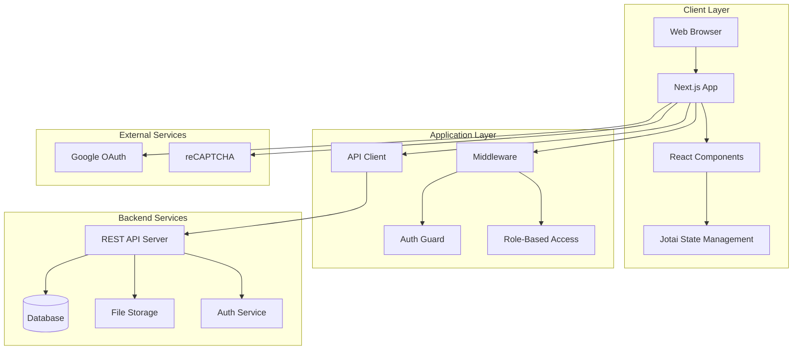
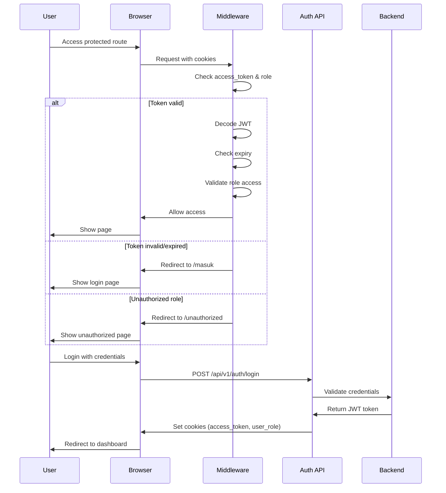
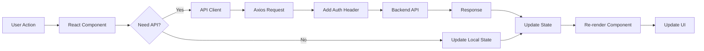
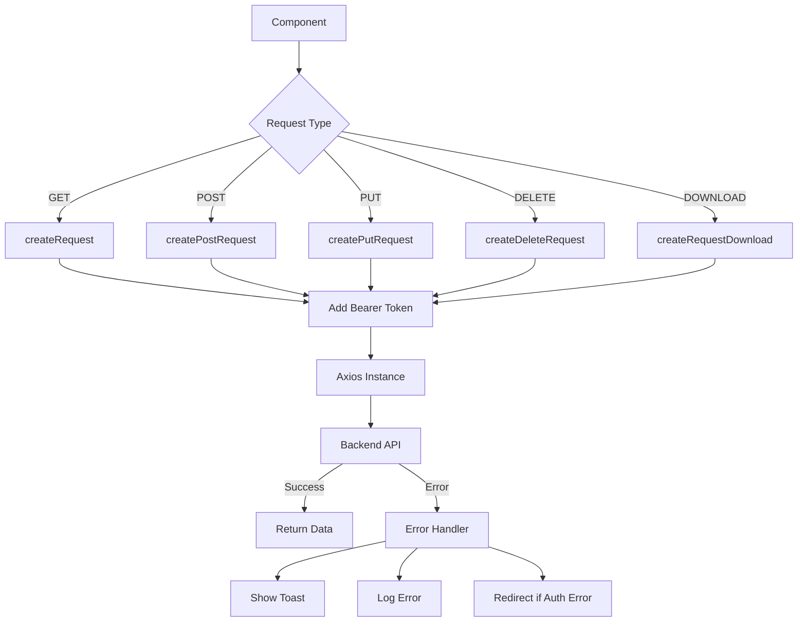
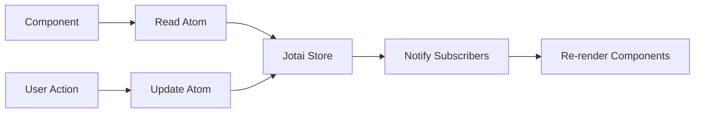

# Technical Architectures - Bengkel Koding Web V2

## Architecture Overview

Bengkel Koding Web V2 dibangun dengan arsitektur **modern web application** menggunakan Next.js 14 dengan App Router, TypeScript, dan Tailwind CSS. Sistem menggunakan **client-server architecture** dengan RESTful API sebagai backend communication layer.

---

## System Architecture Diagram



---

## Technology Stack

### Frontend

| Technology       | Version | Purpose                           |
| ---------------- | ------- | --------------------------------- |
| **Next.js**      | 14.2.3  | React framework dengan App Router |
| **React**        | 18.3.1  | UI library                        |
| **TypeScript**   | Latest  | Type safety                       |
| **Tailwind CSS** | Latest  | Utility-first CSS framework       |
| **Jotai**        | 2.12.5  | Atomic state management           |

### UI Components & Libraries

| Library                | Purpose                     |
| ---------------------- | --------------------------- |
| **Milkdown**           | Rich text editor (Markdown) |
| **ApexCharts**         | Data visualization          |
| **react-toastify**     | Toast notifications         |
| **emoji-picker-react** | Emoji picker component      |
| **QRCode.react**       | QR code generator           |

### HTTP & API

| Library       | Purpose           |
| ------------- | ----------------- |
| **Axios**     | HTTP client       |
| **js-cookie** | Cookie management |

---

## Authentication Flow



---

## Application Structure

### Route Structure (App Router)

```
app/
├── (auth)/              # Auth routes group
│   ├── masuk/          # Login page
│   ├── lupa-password/  # Forgot password
│   └── reset-password/ # Reset password
│
├── (landing)/          # Public routes group
│   ├── page.tsx        # Homepage
│   ├── about/          # About page
│   ├── kursus/         # Course catalog
│   │   └── [id-kursus]/ # Course detail
│   ├── learning-path/  # Learning paths
│   ├── event/          # Events
│   └── verifikasi-sertifikat/ # Certificate verification
│
├── (dashboard)/        # Protected routes group
│   └── dashboard/
│       ├── student/    # Student dashboard
│       ├── asisten/    # Assistant dashboard
│       ├── dosen/      # Lecturer dashboard
│       ├── admin/      # Admin dashboard
│       └── superadmin/ # Super admin dashboard
│
└── api/                # API integration layer
    ├── auth.ts         # Auth APIs
    ├── courses.ts      # Course APIs
    ├── kelas.ts        # Class APIs
    ├── absence.ts      # Attendance APIs
    └── ...
```

### Component Architecture

```mermaid
graph TD
    A[App Layout] --> B[Route Groups]
    B --> C[(auth) Group]
    B --> D[(landing) Group]
    B --> E[(dashboard) Group]

    E --> F[Role-Based Dashboards]
    F --> G[Student Dashboard]
    F --> H[Asisten Dashboard]
    F --> I[Dosen Dashboard]
    F --> J[Admin Dashboard]
    F --> K[Superadmin Dashboard]

    A --> L[Shared Components]
    L --> M[UI Components]
    L --> N[Layout Components]
    L --> O[Feature Components]
```

---

## Data Flow



---

## Security Architecture

### Authentication & Authorization

1. **JWT-based Authentication**

   - Token stored in HTTP-only cookies
   - Automatic token validation in middleware
   - Token expiry checking

2. **Role-Based Access Control (RBAC)**

   - 5 roles: student, asisten, dosen, admin, superadmin
   - Route protection based on roles
   - Middleware-level enforcement

3. **Security Measures**
   - reCAPTCHA integration
   - CSRF protection
   - XSS prevention
   - SQL injection protection (backend)

### Middleware Protection

```typescript
// middleware.ts
const rolePaths = {
  student: ["/dashboard/student"],
  asisten: ["/dashboard/asisten"],
  dosen: ["/dashboard/dosen"],
  admin: ["/dashboard/admin"],
  superadmin: ["/dashboard/superadmin"],
};

// Protected routes: /dashboard/*
// Validates: access_token, user_role, token expiry
```

---

## API Integration Architecture

### API Client Layer



### API Modules

- **auth.ts** - Authentication & authorization
- **courses.ts** - Course management
- **kelas.ts** - Class management
- **absence.ts** - Attendance tracking
- **penugasan.ts** - Assignment management
- **certificate.ts** - Certificate generation
- **learning-path/** - Learning path APIs
- **admin/** - Admin-specific APIs
- **student/** - Student-specific APIs

---

## State Management

### Jotai Atoms

```typescript
// Global state management using Jotai
import { atom } from "jotai";

// Example atoms
const userAtom = atom(null);
const courseAtom = atom([]);
const selectedClassAtom = atom(null);
```

### State Flow



---

## Responsive Design

### Breakpoints (Tailwind)

| Breakpoint | Width  | Target        |
| ---------- | ------ | ------------- |
| `sm`       | 640px  | Small tablets |
| `md`       | 768px  | Tablets       |
| `lg`       | 1024px | Small laptops |
| `xl`       | 1280px | Desktops      |
| `2xl`      | 1536px | Large screens |

---

## Performance Optimization

### Next.js Features Used

1. **App Router** - Modern routing with layouts
2. **Server Components** - Default server-side rendering
3. **Image Optimization** - next/image for optimized images
4. **Font Optimization** - next/font for Google Fonts
5. **Code Splitting** - Automatic route-based splitting

### Performance Strategies

- Lazy loading components
- Image optimization with next/image
- API response caching
- Debouncing user inputs
- Memoization for expensive computations

---

## Development Environment

### Environment Variables

```env
# API Configuration
NEXT_PUBLIC_API_URL_BENGKEL_KODING=http://localhost:8080
NEXT_PUBLIC_GETAPICLASSROOM_URL_BENGKEL_KODING=http://localhost:8080

# Authentication
NEXT_PUBLIC_API_LOGIN_WITH_GOOGLE=http://localhost:8080

# Image Domains
NEXT_PUBLIC_IMAGE_DOMAINS=bengkod-api.rayhanashlikh.my.id,...

# reCAPTCHA
NEXT_PUBLIC_RECAPTCHA_SITE_KEY=your_site_key
RECAPTCHA_SECRET_KEY=your_secret_key
```

### Build & Deployment

```bash
# Development
bun dev           # Start dev server (port 3000)

# Production
bun build         # Build for production
bun start         # Start production server

# Linting
bun lint          # Run ESLint
```

---

## Package Management

**Package Manager**: Bun (fast JavaScript runtime)

**Key Dependencies**:

- Production: 25+ packages
- Development: 10+ packages
- Total bundle optimized with tree-shaking

---

## Integration Points

### External Services

1. **Google OAuth** - Social login
2. **reCAPTCHA** - Bot protection
3. **Backend API** - Main data source
4. **File Storage** - Image and document hosting

---

## Monitoring & Logging

### Error Handling

```typescript
// Centralized error handling
try {
  const response = await apiCall();
  return response.data;
} catch (error) {
  if (error.response) {
    // Server error
    toast.error(error.response.data.message);
  } else if (error.request) {
    // Network error
    toast.error("Network error");
  } else {
    // Client error
    toast.error("An error occurred");
  }
}
```

---

[← Back: Software Vision](getting-started-Software-Vision.md) | [Next: Database Schema →](development-guide-Database-Schema.md)
