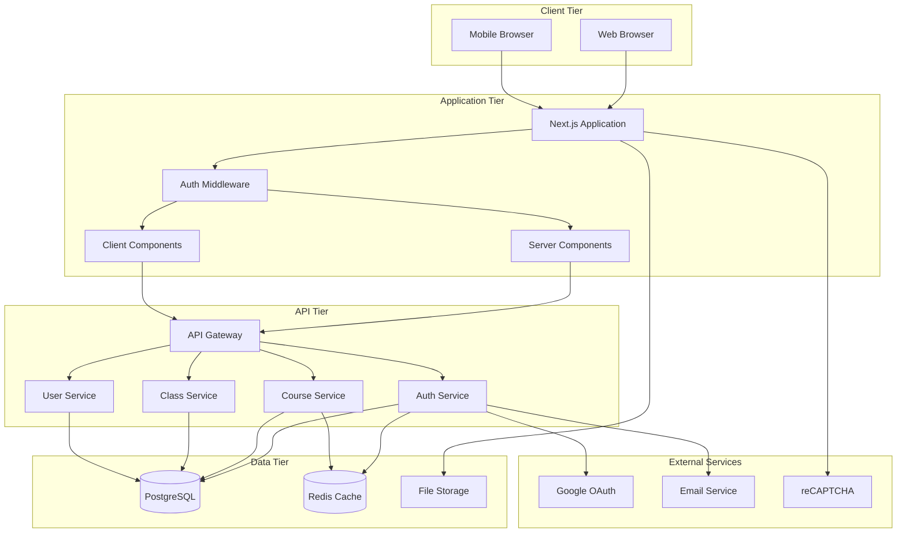
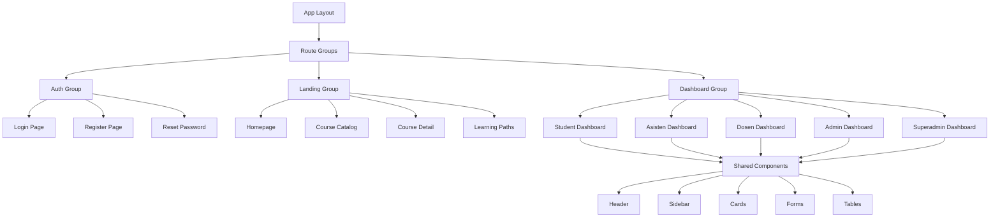
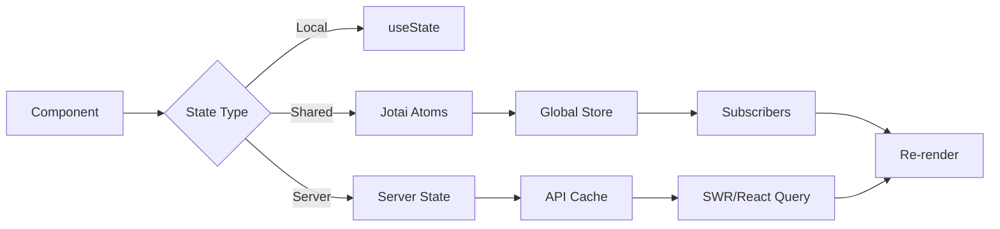
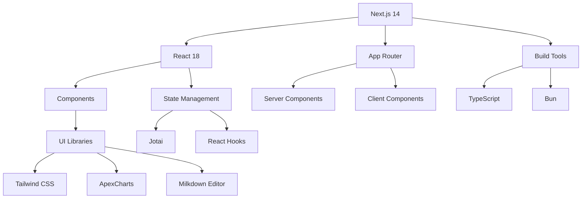
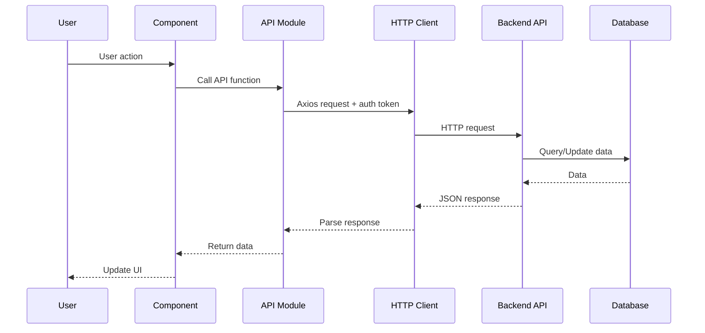
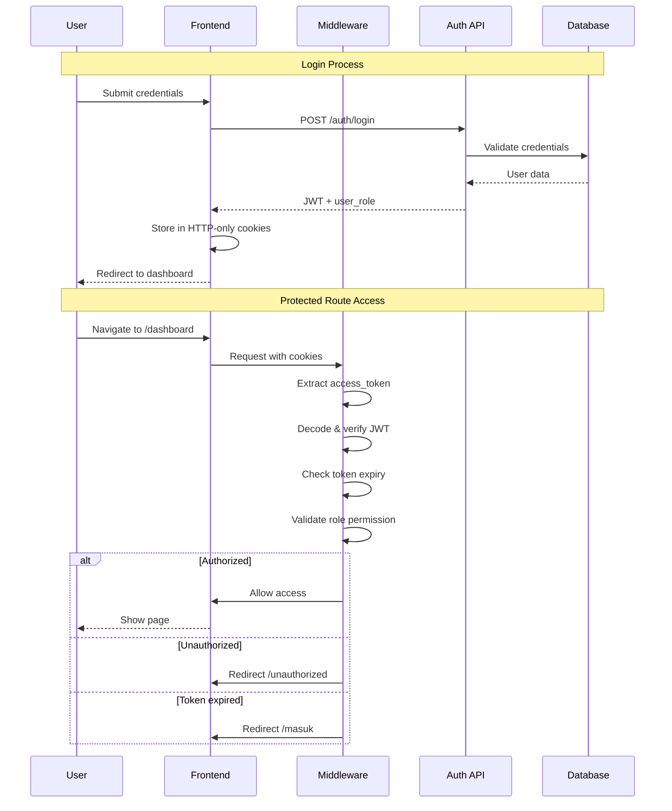
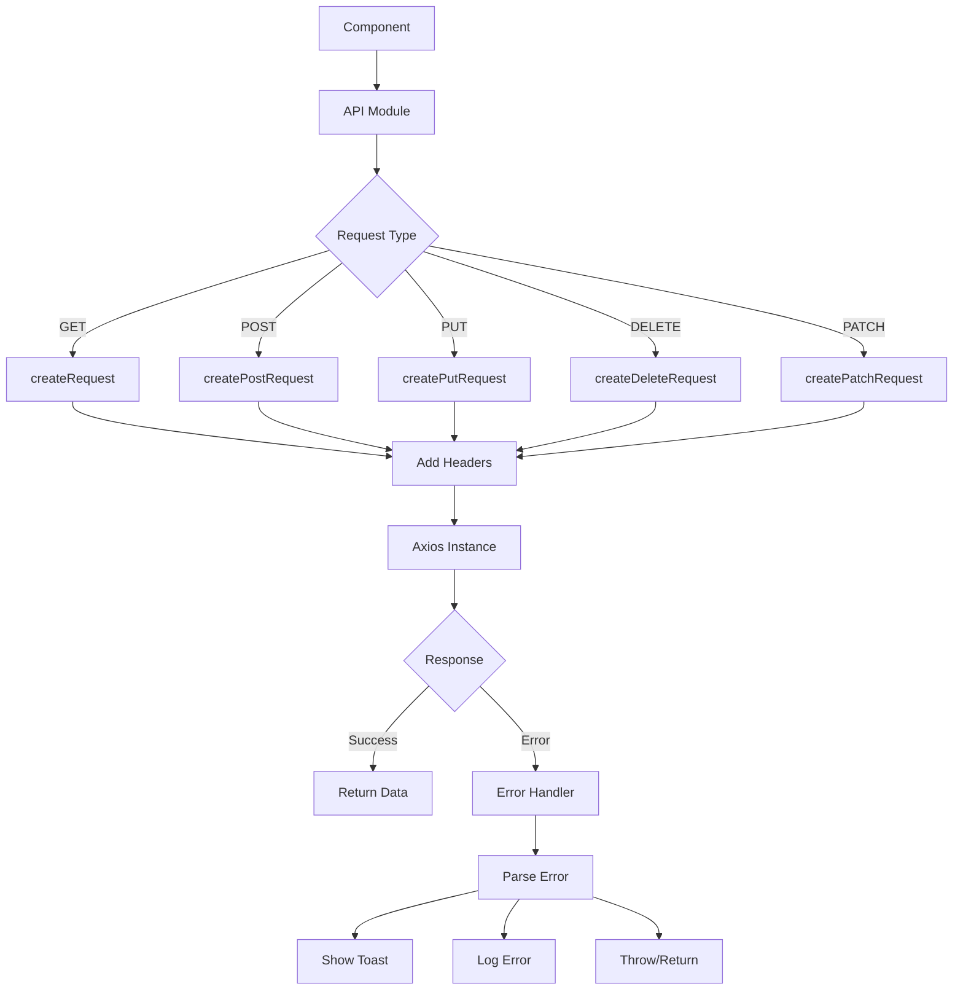
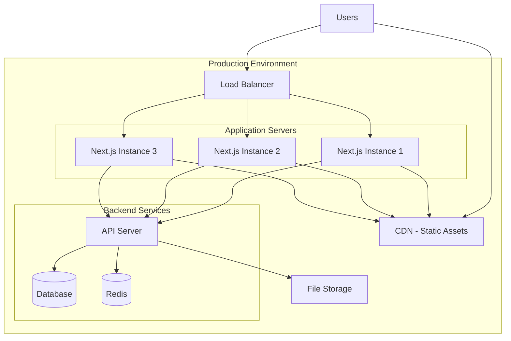
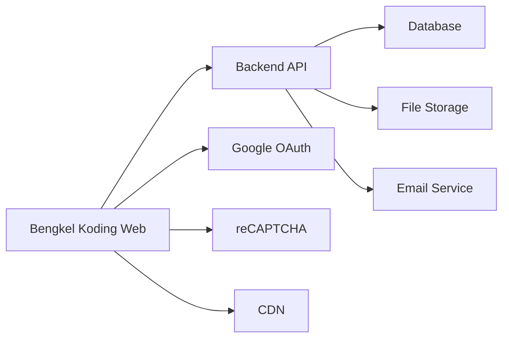

# Technical Architectures (Full Documentation)

## Table of Contents

1. [System Architecture](#1-system-architecture)
2. [Application Architecture](#2-application-architecture)
3. [Technology Stack](#3-technology-stack)
4. [Data Architecture](#4-data-architecture)
5. [Security Architecture](#5-security-architecture)
6. [API Architecture](#6-api-architecture)
7. [Deployment Architecture](#7-deployment-architecture)
8. [Performance Architecture](#8-performance-architecture)

---

## 1. System Architecture

### 1.1 High-Level Architecture



### 1.2 Architecture Principles

#### Separation of Concerns

- **Presentation Layer**: React components (UI)
- **Business Logic Layer**: API integration modules
- **Data Access Layer**: Backend API calls
- **Persistence Layer**: Database (Backend)

#### Modularity

- Route groups untuk organization
- Reusable components
- Shared utilities dan helpers
- Interface definitions

#### Scalability

- Server-side rendering untuk SEO
- Client-side rendering untuk interactivity
- Code splitting per route
- Lazy loading components

#### Security-First

- Middleware authentication
- Role-based authorization
- Input validation
- XSS/CSRF protection

---

## 2. Application Architecture

### 2.1 Next.js App Router Structure

```
app/
├── (auth)/                    # Authentication routes
│   ├── masuk/                # Login
│   ├── lupa-password/        # Forgot password
│   └── reset-password/       # Reset password
│
├── (landing)/                # Public pages
│   ├── page.tsx             # Homepage
│   ├── about/               # About page
│   ├── kursus/              # Course catalog
│   │   └── [id-kursus]/    # Dynamic course detail
│   ├── learning-path/       # Learning paths
│   ├── event/               # Events
│   └── verifikasi-sertifikat/ # Certificate verification
│
├── (dashboard)/             # Protected routes
│   └── dashboard/
│       ├── student/         # Student dashboard
│       ├── asisten/         # Assistant dashboard
│       ├── dosen/           # Lecturer dashboard
│       ├── admin/           # Admin dashboard
│       └── superadmin/      # Super admin dashboard
│
├── api/                     # API integration layer
│   ├── auth.ts              # Authentication APIs
│   ├── courses.ts           # Course APIs
│   ├── kelas.ts             # Class APIs
│   ├── absence.ts           # Attendance APIs
│   ├── penugasan.ts         # Assignment APIs
│   ├── certificate.ts       # Certificate APIs
│   ├── learning-path/       # Learning path APIs
│   ├── student/             # Student-specific APIs
│   ├── dosen/               # Lecturer-specific APIs
│   ├── assistant/           # Assistant-specific APIs
│   └── admin/               # Admin-specific APIs
│
├── component/               # Shared components
│   ├── general/            # Generic UI components
│   ├── dashboard/          # Dashboard components
│   ├── kelas/              # Class components
│   ├── kursus/             # Course components
│   ├── learning-path/      # Learning path components
│   └── markdown-editor/    # Editor components
│
├── interface/              # TypeScript interfaces
│   ├── User.ts
│   ├── Course.ts
│   ├── Kelas.ts
│   ├── Absence.ts
│   ├── Assigment.ts
│   ├── LearningPath.ts
│   └── ...
│
├── lib/                    # Utility functions
│   ├── formatDate.ts
│   ├── getRolePath.ts
│   ├── timeNow.ts
│   └── validUrl.tsx
│
├── layout.tsx              # Root layout
└── globals.css             # Global styles
```

### 2.2 Component Architecture



### 2.3 State Management Architecture



**State Management Strategy**:

1. **Local State** - `useState` untuk component-specific state
2. **Global State** - Jotai atoms untuk shared state
3. **Server State** - Backend data fetched via API
4. **URL State** - Query parameters untuk shareable state

---

## 3. Technology Stack

### 3.1 Frontend Stack



#### Core Technologies

| Technology       | Version | Purpose                           |
| ---------------- | ------- | --------------------------------- |
| **Next.js**      | 14.2.3  | React framework, routing, SSR     |
| **React**        | 18.3.1  | UI library                        |
| **TypeScript**   | Latest  | Type safety, developer experience |
| **Tailwind CSS** | Latest  | Utility-first styling             |
| **Jotai**        | 2.12.5  | Atomic state management           |
| **Axios**        | 1.10.0  | HTTP client                       |
| **Bun**          | Latest  | Package manager, runtime          |

#### UI & Visualization

| Library                | Purpose                   |
| ---------------------- | ------------------------- |
| **Milkdown**           | Rich text/Markdown editor |
| **ApexCharts**         | Data visualization        |
| **react-toastify**     | Toast notifications       |
| **emoji-picker-react** | Emoji picker              |
| **QRCode.react**       | QR code generation        |
| **react-latex-next**   | LaTeX rendering           |

### 3.2 Development Tools

| Tool         | Purpose         |
| ------------ | --------------- |
| **ESLint**   | Code linting    |
| **Prettier** | Code formatting |
| **Git**      | Version control |
| **VS Code**  | IDE             |

---

## 4. Data Architecture

### 4.1 Data Flow Diagram



### 4.2 Data Models (Frontend)

#### User Interface

```typescript
interface User {
  id: number;
  email: string;
  name: string;
  nim_nidn: string;
  role: "student" | "asisten" | "dosen" | "admin" | "superadmin";
  avatar?: string;
  created_at: string;
  updated_at: string;
}
```

#### Course Interface

```typescript
interface Course {
  id: number;
  title: string;
  slug: string;
  description: string;
  thumbnail: string;
  category_id: number;
  instructor_id: number;
  level: "beginner" | "intermediate" | "advanced";
  duration: number;
  is_published: boolean;
  created_at: string;
  updated_at: string;
}
```

#### Class Interface

```typescript
interface Class {
  id: number;
  name: string;
  course_id: number;
  instructor_id: number;
  assistant_id?: number;
  start_date: string;
  end_date: string;
  status: "active" | "completed" | "cancelled";
  max_students: number;
  created_at: string;
  updated_at: string;
}
```

#### Assignment Interface

```typescript
interface Assignment {
  id: number;
  session_id: number;
  title: string;
  description: string;
  instruction: string;
  deadline: string;
  max_score: number;
  type: "homework" | "project" | "quiz";
  is_published: boolean;
  created_at: string;
  updated_at: string;
}
```

### 4.3 API Response Structure

```typescript
// Standard API Response
interface ApiResponse<T> {
  data: T;
  meta: {
    status: number;
    message: string;
    timestamp: string;
  };
}

// Paginated Response
interface PaginatedResponse<T> {
  data: T[];
  meta: {
    status: number;
    message: string;
    page: number;
    per_page: number;
    total: number;
    total_pages: number;
  };
}
```

---

## 5. Security Architecture

### 5.1 Authentication Flow



### 5.2 Authorization Matrix

| Route Pattern             | Student | Asisten | Dosen | Admin | SuperAdmin |
| ------------------------- | ------- | ------- | ----- | ----- | ---------- |
| `/dashboard/student/*`    | ✅      | ❌      | ❌    | ❌    | ✅         |
| `/dashboard/asisten/*`    | ❌      | ✅      | ❌    | ❌    | ✅         |
| `/dashboard/dosen/*`      | ❌      | ❌      | ✅    | ❌    | ✅         |
| `/dashboard/admin/*`      | ❌      | ❌      | ❌    | ✅    | ✅         |
| `/dashboard/superadmin/*` | ❌      | ❌      | ❌    | ❌    | ✅         |

### 5.3 Security Measures

#### Client-Side Security

```typescript
// middleware.ts - Route Protection
export function middleware(request: NextRequest) {
  const accessToken = request.cookies.get("access_token")?.value;
  const role = request.cookies.get("user_role")?.value;

  // 1. Authentication Check
  if (!accessToken || !role) {
    return NextResponse.redirect(new URL("/masuk", request.url));
  }

  // 2. Token Validation
  try {
    const payload = decodeJWT(accessToken);

    // 3. Expiry Check
    if (payload.exp < Math.floor(Date.now() / 1000)) {
      throw new Error("Token expired");
    }

    // 4. Authorization Check
    if (!isAuthorized(role, request.nextUrl.pathname)) {
      return NextResponse.redirect(new URL("/unauthorized", request.url));
    }
  } catch (error) {
    return NextResponse.redirect(new URL("/masuk", request.url));
  }

  return NextResponse.next();
}
```

#### API Security

```typescript
// API request with authentication
export const createRequest = async (url: string): Promise<AxiosResponse> => {
  const accessToken = Cookies.get("access_token");

  if (!accessToken) {
    throw new Error("Access token not found");
  }

  const config = {
    headers: {
      Authorization: `Bearer ${accessToken}`,
      "Content-Type": "application/json",
    },
  };

  const response = await Axios.get(`${API_URL}${url}`, config);
  return response.data;
};
```

#### Input Validation

```typescript
// Client-side validation example
const validateEmail = (email: string): boolean => {
  const emailRegex = /^[^\s@]+@[^\s@]+\.[^\s@]+$/;
  return emailRegex.test(email);
};

const validatePassword = (password: string): boolean => {
  // Min 8 chars, at least 1 letter and 1 number
  const passwordRegex = /^(?=.*[A-Za-z])(?=.*\d)[A-Za-z\d]{8,}$/;
  return passwordRegex.test(password);
};
```

---

## 6. API Architecture

### 6.1 API Integration Layer



### 6.2 API Endpoints Organization

```
app/api/
├── request.ts                    # Base HTTP client functions
├── auth.ts                       # Authentication endpoints
├── courses.ts                    # Course management
├── kelas.ts                      # Class management
├── absence.ts                    # Attendance tracking
├── penugasan.ts                  # Assignment management
├── certificate.ts                # Certificate generation
├── event.ts                      # Event management
├── faq.ts                        # FAQ management
│
├── learning-path/                # Learning path APIs
│   ├── API-LearningPath.ts
│   ├── aktivasiToken.ts
│   ├── getDetail-learningPath.ts
│   └── getMenu-learningpaths.ts
│
├── student/                      # Student-specific APIs
│   ├── courses.ts
│   ├── assignments.ts
│   └── ...
│
├── dosen/                        # Lecturer-specific APIs
│   ├── courses.ts
│   ├── api-kelas/
│   └── ...
│
├── assistant/                    # Assistant-specific APIs
│   └── courses.ts
│
└── admin/                        # Admin-specific APIs
    ├── course.ts
    ├── dashboard.ts
    ├── learning-path.ts
    └── ...
```

### 6.3 API Client Functions

```typescript
// Base Request Function
export const createRequest = async (url: string): Promise<AxiosResponse> => {
  const accessToken = Cookies.get("access_token");

  if (!accessToken) {
    throw new Error("Access token not found");
  }

  try {
    const config = {
      headers: { Authorization: `Bearer ${accessToken}` },
    };

    const response = await Axios.get(`${API_URL}${url}`, config);
    return response.data;
  } catch (error) {
    handleApiError(error, url);
    throw error;
  }
};

// POST Request
export const createPostRequest = async (
  url: string,
  data: any
): Promise<AxiosResponse> => {
  const accessToken = Cookies.get("access_token");

  try {
    const config = {
      headers: { Authorization: `Bearer ${accessToken}` },
    };

    const response = await Axios.post(`${API_URL}${url}`, data, config);
    return response.data;
  } catch (error) {
    handleApiError(error, url);
    throw error;
  }
};

// Error Handler
const handleApiError = (error: any, url: string) => {
  if (error.response) {
    // Server error
    toast.error(error.response.data.meta.message);
  } else if (error.request) {
    // Network error
    toast.error("Network error. Please check your connection.");
  } else {
    // Request setup error
    toast.error("An unexpected error occurred.");
  }

  console.error(`API Error for ${url}:`, error);
};
```

---

## 7. Deployment Architecture

### 7.1 Deployment Diagram



### 7.2 Build & Deployment Process

```bash
# Development
bun install          # Install dependencies
bun dev             # Start dev server (localhost:3000)

# Production Build
bun run build       # Next.js build
# Output: .next/ directory

# Production Start
bun start           # Start production server

# Docker Deployment (Example)
docker build -t bengkelkoding-web .
docker run -p 3000:3000 bengkelkoding-web
```

### 7.3 Environment Configuration

```env
# Production Environment Variables
NODE_ENV=production

# API Configuration
NEXT_PUBLIC_API_URL_BENGKEL_KODING=https://api.bengkelkoding.dinus.ac.id
NEXT_PUBLIC_GETAPICLASSROOM_URL_BENGKEL_KODING=https://api.bengkelkoding.dinus.ac.id

# Authentication
NEXT_PUBLIC_API_LOGIN_WITH_GOOGLE=https://api.bengkelkoding.dinus.ac.id

# Image Domains
NEXT_PUBLIC_IMAGE_DOMAINS=bengkod-api.rayhanashlikh.my.id,mahasiswa.dinus.ac.id,simpeg.dinus.ac.id

# Security
NEXT_PUBLIC_RECAPTCHA_SITE_KEY=your_production_site_key
RECAPTCHA_SECRET_KEY=your_production_secret_key
```

---

## 8. Performance Architecture

### 8.1 Performance Optimization Strategies

#### Code Splitting

```typescript
// Dynamic imports for code splitting
import dynamic from "next/dynamic";

const HeavyComponent = dynamic(() => import("@/app/component/HeavyComponent"), {
  loading: () => <Skeleton />,
  ssr: false, // Client-side only if needed
});
```

#### Image Optimization

```typescript
import Image from "next/image";

<Image
  src="/img/course-thumbnail.jpg"
  alt="Course Thumbnail"
  width={400}
  height={300}
  loading="lazy"
  placeholder="blur"
  blurDataURL="data:image/..."
/>;
```

#### API Response Caching

```typescript
// SWR for client-side caching
import useSWR from "swr";

const { data, error } = useSWR("/api/courses", fetcher, {
  revalidateOnFocus: false,
  dedupingInterval: 60000, // 1 minute
});
```

### 8.2 Performance Metrics

| Metric                             | Target  | Measurement Method   |
| ---------------------------------- | ------- | -------------------- |
| **First Contentful Paint (FCP)**   | < 1.5s  | Lighthouse           |
| **Largest Contentful Paint (LCP)** | < 2.5s  | Lighthouse           |
| **Time to Interactive (TTI)**      | < 3.5s  | Lighthouse           |
| **Cumulative Layout Shift (CLS)**  | < 0.1   | Lighthouse           |
| **First Input Delay (FID)**        | < 100ms | Real User Monitoring |

### 8.3 Monitoring & Observability

```typescript
// Error boundary for catching errors
export class ErrorBoundary extends React.Component {
  componentDidCatch(error: Error, errorInfo: React.ErrorInfo) {
    // Log to error tracking service
    logErrorToService(error, errorInfo);
  }

  render() {
    if (this.state.hasError) {
      return <ErrorFallback />;
    }
    return this.props.children;
  }
}

// Performance monitoring
export const measurePerformance = (metricName: string, duration: number) => {
  // Send to analytics
  analytics.track("performance_metric", {
    name: metricName,
    duration: duration,
    timestamp: Date.now(),
  });
};
```

---

## 9. Integration Architecture

### 9.1 External Service Integrations



#### Integration Points

| Service           | Purpose           | Protocol   |
| ----------------- | ----------------- | ---------- |
| **Backend API**   | Data operations   | REST/HTTP  |
| **Google OAuth**  | Social login      | OAuth 2.0  |
| **reCAPTCHA**     | Bot protection    | HTTP API   |
| **CDN**           | Static assets     | HTTP/HTTPS |
| **File Storage**  | Images, documents | HTTP/S3    |
| **Email Service** | Notifications     | SMTP       |

---

## 10. Scalability & Future Considerations

### 10.1 Horizontal Scaling

- Load balancer untuk distribute traffic
- Multiple Next.js instances
- Stateless application design
- Session stored in cookies (JWT)

### 10.2 Vertical Scaling

- Server resources (CPU, RAM)
- Database optimization
- Query performance tuning
- Index optimization

### 10.3 Future Architecture Enhancements

1. **Microservices Migration** - Break monolithic backend into microservices
2. **GraphQL Layer** - Add GraphQL for flexible data fetching
3. **WebSocket Support** - Real-time features (chat, notifications)
4. **Edge Computing** - Deploy to edge locations untuk low latency
5. **Serverless Functions** - API routes as serverless functions

---

[← Back: Software Vision](software-vision.md) | [Next: Database Schema (Full) →](database-schema.md)
